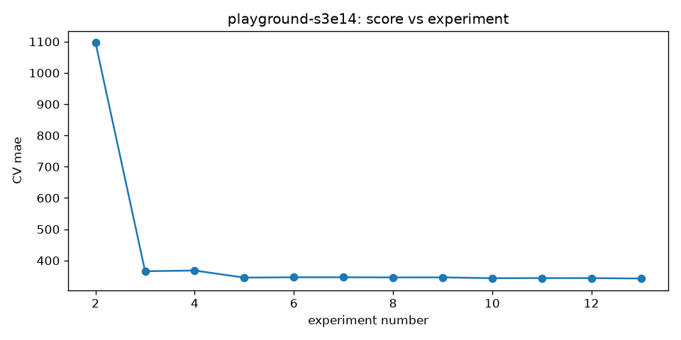

# RESULT — Prediction of Wild Blueberry Yield (Playground S3E14) (`playground-s3e14`)

## Final grade

| | |
|---|---|
| metric | mae (minimize) |
| private score | **335.772633** |
| rank-equivalent | 601 of 1877 teams |
| percentile | top 32.0% |
| medal band | none |

> **The rank/percentile/medal above is an ESTIMATE, not a true leaderboard
> result.** Kaggle does not publish Playground private test labels, so this
> submission was scored on a seeded 20% holdout (3,058 rows) carved from the
> original train *before* the agent loop saw any data (see
> `scripts/prepare_playground_s3e14.py` and DECISIONS.md). The score was then
> located in the real final private leaderboard (1,877 teams). Caveats: the
> holdout is drawn from the train distribution rather than Kaggle's actual
> test split; leaderboard teams optimized against Kaggle's own test set; and
> a 3,058-row MAE is noisier than the ~6.9k-row private test MAE. The
> CV-vs-holdout gap here (CV 342.49 → holdout 335.77) illustrates that noise.

## Budget consumed

- experiments: 13 of 25 (12 completed)
- wall clock: 325s of 14400s

## Score progression

## Top-3 experiments

1. **e0013** (cv 342.493905) — The OOF-selected equal blend of XGB, CatBoost, tuned LGBM and its seed-bag, snapped to the target grid, is the best final: OOF says 342.49 vs 343.36 for the previous blend.
2. **e0010** (cv 343.360407) — An equal-weight blend of the three L1 GBMs preserves the MAE geometry better than an L2-fit linear stack, and with grid snapping should beat e0005 and e0009.
3. **e0012** (cv 343.631958) — Averaging the tuned L1 LightGBM over five seeds reduces bagging variance and should nudge CV below e0011's 343.78.

