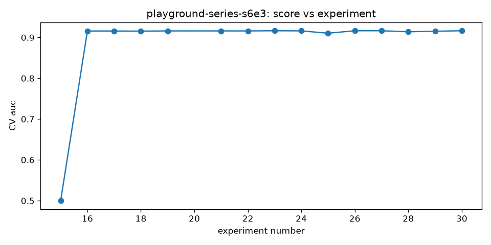

# RESULT — Telco Customer Churn (Playground S6E3) (`playground-series-s6e3`)

## Final grade

| | |
|---|---|
| metric | auc (maximize) |
| private score | **0.917088** |
| rank-equivalent | 655 of 4143 teams |
| percentile | top 15.8% |
| medal band | none |

> **The rank/percentile/medal above is an ESTIMATE, not a true leaderboard
> result.** Kaggle does not publish Playground private test labels, so this
> submission was scored on a seeded, stratified 20% holdout (118,839 rows)
> carved from the original train *before* the agent loop saw any data (see
> `scripts/prepare_playground_s6e3.py` and DECISIONS.md). The score was then
> located in the real final private leaderboard (4,143 teams). Caveats: the
> holdout is drawn from the train distribution rather than Kaggle's actual
> 254,655-row test split; leaderboard teams optimized against Kaggle's own
> test set; and AUC on 118,839 holdout rows is noisier than on the true test.
> The CV-vs-holdout gap here (CV 0.916430 → holdout 0.917088) illustrates
> that noise — bronze (rank ≤ 414) needed 0.91791, less than 0.001 away.

## Budget consumed

- experiments: 17 of 25 (15 completed)
- wall clock: 2086s of 14400s

## Score progression

## Top-3 experiments

1. **e0023** (cv 0.916430) — LightGBM, XGBoost and CatBoost make partially decorrelated ranking errors, so a greedy forward rank-blend of the six completed models beats the best single (.916020).
2. **e0027** (cv 0.916430) — Exhaustive equal-weight subset search plus an integer-weight hill climb finds a strictly better rank-blend than greedy's path-dependent optimum of .916430.
3. **e0030** (cv 0.916430) — Adding the DART member to the exhaustive subset + integer-weight search finds a blend strictly above .916430; if not, the four-member blend is the confirmed optimum.

